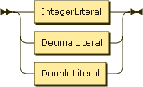
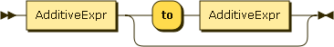
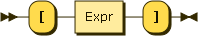
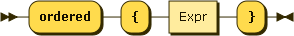
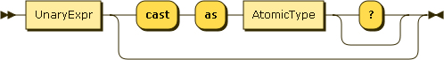

# Expressions

### Construction of items <a href="#chapter-construction" id="chapter-construction"></a>

In JSONiq, objects, arrays and basic atomic values (string, number, boolean, null) are constructed exactly as they are constructed in JSON. Any JSON document is also a valid JSONiq query which just "returns itself".

Because JSONiq expressions are fully composable, however, in objects and arrays constructors, it is possible to put any JSONiq expression and not only atomic literals, object constructors and array constructors. Furthermore, JSONiq supports the construction of other W3C-standardized builtin types (date, hexBinary, etc).

The following examples are a few of many operators available in JSONiq: "to" for creating arithmetic sequences, "||" for concatenating strings, "+" for adding numbers, "," for appending sequences.

In an array, the operand expression will evaluated to a sequence of items, and these items will be copied and become members of the newly created array.

#### Composable array constructors

```

  [ 1 to 10 ]
    
```

Result:\[ 1, 2, 3, 4, 5, 6, 7, 8, 9, 10 ]

In an object, the expression you use for the key must evaluate to an atomic - if it is not a string, it will just be cast to it.

#### Composable object keys

```

  { "foo" || "bar" : true }
      
```

Result:{ "foobar" : true }

An error is raised if the key expressions is not an atomic.

#### Non-atomic object keys

```

  { [ 1, 2 ] : true }
      
```

Result:An error was raised: can not atomize an array item: an array has probably been passed where an atomic value is expected (e.g., as a key, or to a function expecting an atomic item)

If the value expression is empty, null will be used as a value, and if it contains two items or more, they will be wrapped into an array.

If the colon is preceded with a question mark, then the pair will be omitted if the value expression evaluates to the empty sequence.

#### Composable object values

```

  { "foo" : 1 + 1 }
      
```

Result:{ "foo" : 2 }

#### Composable object values and automatic conversion

```

  { "foo" : (), "bar" : (1, 2) }
      
```

Result:{ "foo" : null, "bar" : \[ 1, 2 ] }

#### Optional pair (not implemented yet in Zorba)

```

  { "foo" ?: (), "bar" : (1, 2) }
      
```

Result:An error was raised: invalid expression: syntax error, unexpected "?", expecting "end of file" or "," or "}"

The {| |} syntax can be used to merge several objects.

#### Merging object constructor

```

  {| { "foo" : "bar" }, { "bar" : "foo" } |}
      
```

Result:{ "foo" : "bar", "bar" : "foo" }

An error is raised if the operand expression does not evaluate to a sequence of objects.

#### Merging object constructor with a type error

```

  {| 1 |}
      
```

Result:An error was raised: xs:integer can not be treated as type object()\*

#### Numbers <a href="#numbers.d12e1832" id="numbers.d12e1832"></a>

JSONiq follows the [W3C standard](https://www.w3.org/TR/xquery-30/#id-literals) for constructing numbers. The following explanations, provided as an informal summary for convenience, are non-normative.

Literal


NumericLiteral



IntegerLiteral


DecimalLiteral


DoubleLiteral


The syntax for creating numbers is identical to that of JSON (it is actually a more flexible superset, for example leading 0s are allowed, and a decimal literal can begin with a dot). Note that JSONiq distinguishes between integers (no dot, no scientific notation), decimals (dot but no scientific notation) and doubles (scientific notation). As expected, an integer literal creates an atomic of type integer, and so on.

**Integer literals**

```

42
      
```

Result:42

**Decimal literals**

```

3.14
      
```

Result:3.14

**Double literals**

```

+6.022E23
      
```

Result:6.022E23

#### Strings <a href="#strings.d12e1941" id="strings.d12e1941"></a>

The syntax for creating string items is conformant to [JSON](https://www.ecma-international.org/publications/standards/Ecma-404.htm) rather than to the W3C standard for string literals. This means concretely that escaping is done with backslashes and not with ampersands. Also, like in JSON, double quotes are required and single quotes are forbidden.

StringLiteral


**String literals**

```

  "foo"
        
```

Result:foo

**String literals with escaping**

```

  "This is a line\nand this is a new line"
        
```

Result:This is a line and this is a new line

**String literals with Unicode character escaping**

```

  "\u0001"
        
```

Result:\&#x1;

**String literals with a nested quote**

```

  "This is a nested \"quote\""
        
```

Result:This is a nested "quote"

#### Booleans and null <a href="#booleansandnull.d12e2006" id="booleansandnull.d12e2006"></a>

JSONiq also introduces three more literals for constructing booleans and nulls: true, false and null. This makes in particular the functions true() and false() superfluous.

BooleanLiteral


NullLiteral


**Boolean literals (true)**

```

true
      
```

Result:true

**Boolean literals (false)**

```

false
      
```

Result:false

**Null literals**

```

null
      
```

Result:null

#### Other atomic values <a href="#otheratomicvalues.d12e2070" id="otheratomicvalues.d12e2070"></a>

JSONiq follows the [W3C standard](https://www.w3.org/TR/xquery-30/#id-constructor-functions) for constructing most atomic values with constructors. In JSONiq, the _xs_ prefix is optional.

#### Objects <a href="#objects.d12e2084" id="objects.d12e2084"></a>

Expressions constructing objects are JSONiq-specific and introduced in this specification.

ObjectConstructor


PairConstructor


The syntax for creating objects is identical to that of JSON. You can use for an object key any string literal, and for an object value any literal, object constructor or array constructor.

**Empty object constructors**

```

{}
      
```

Result:{ }

**Object constructors 1**

```

{ "foo" : "bar" }
      
```

Result:{ "foo" : "bar" }

**Object constructors 2**

```

{ "foo" : [ 1, 2, 3, 4, 5, 6 ] }
      
```

Result:{ "foo" : \[ 1, 2, 3, 4, 5, 6 ] }

**Object constructors 3**

```

{ "foo" : true, "bar" : false }
      
```

Result:{ "foo" : true, "bar" : false }

**Nested object constructors**

```

{ "this is a key" : { "value" : "a value" } }
      
```

Result:{ "this is a key" : { "value" : "a value" } }

As in JavaScript, if your key is simple enough (like alphanumerics, underscores, dashes, this kind of things), the quotes can be omitted. The strings for which quotes are not mandatory are called NCNames. This class of strings can be used for unquoted keys, for variable and function names, and for module aliases.

**Object constructors with unquoted key 1**

```

{ foo : "bar" }
      
```

Result:{ "foo" : "bar" }

**Object constructors with unquoted key 2**

```

{ foo : [ 1, 2, 3, 4, 5, 6 ] }
      
```

Result:{ "foo" : \[ 1, 2, 3, 4, 5, 6 ] }

**Object constructors with unquoted key 3**

```

{ foo : "bar", bar : "foo" }
      
```

Result:{ "foo" : "bar", "bar" : "foo" }

**Object constructors with needed quotes around the key**

```

{ "but you need the quotes here" : null }
    
```

Result:{ "but you need the quotes here" : null }

Objects can be constructed more dynamically (e.g., dynamic keys) by constructing and merging smaller objects. Duplicate key names throw an error.

**Object constructors with needed quotes around the key**

```

{|
  for $i in 1 to 3
  return { "foo" || $i : $i }
|}
    
```

Result:{ "foo1" : 1, "foo2" : 2, "foo3" : 3 }

#### Arrays <a href="#arrays.d12e2225" id="arrays.d12e2225"></a>

Expressions constructing arrays are JSONiq-specific and introduced in this specification.

ArrayConstructor


Expr


The syntax for creating arrays is identical to that of JSON: square brackets, comma separated literals, object constructors and arrays constructors.

**Empty array constructors**

```

[]
      
```

Result:\[ ]

**Array constructors**

```

[ 1, 2, 3, 4, 5, 6 ]
      
```

Result:\[ 1, 2, 3, 4, 5, 6 ]

**Nested array constructors**

```

[ "foo", 3.14, [ "Go", "Boldly", "When", "No", "Man", "Has", "Gone", "Before" ], { "foo" : "bar" }, true, false, null ]
      
```

Result:\[ "foo", 3.14, \[ "Go", "Boldly", "When", "No", "Man", "Has", "Gone", "Before" ], { "foo" : "bar" }, true, false, null ]

Square brackets are mandatory. Do not push it.

#### Functions <a href="#functions.d12e2293" id="functions.d12e2293"></a>

JSONiq follows the [W3C standard](https://www.w3.org/TR/xquery-30/#id-inline-func) for constructing function items with inline expressions or [named function references](https://www.w3.org/TR/xquery-30/#id-named-function-ref). The following explanations, provided as an informal summary for convenience, are non-normative.

Function items can be constructed in two ways: by definining its body directly (inline function expression), or by referring by name to a function declared in a prolog.

FunctionItemExpr


**Inline function expression**

JSONiq follows the [W3C standard](https://www.w3.org/TR/xquery-30/#id-inline-func) for constructing function items with inline expressions. The following explanations, provided as an informal summary for convenience, are non-normative.

A function can be built directly by specifying its parameters and its body as expression. Types are optional and by default, assumed to be item\*.

Function items can also be produced with a partial function application.

**Inline function expression**

```

           function ($x as integer, $y as integer) as integer { $x + 2 },
           function ($x) { $x + 2 }
       
```

Result(two function items)

InlineFunctionExpr


ParamList


**Named function reference**

JSONiq follows the [W3C standard](https://www.w3.org/TR/xquery-30/#id-named-function-ref) for constructing function items with named function references. The following explanations, provided as an informal summary for convenience, are non-normative.

If a function is builtin or declared in a prolog, in the same module or imported, then it is also possible to build a function item by referring to its name and arity.

**Named function reference**

```

           declare function local:sum($x as integer, $y as integer) as integer
           {
             $x + 2
           };
           local:sum#2
       
```

Result(a function items)

NamedFunctionRef


### Manipulating atomic values <a href="#chapter-basic-operations" id="chapter-basic-operations"></a>

We now introduce the expressions that manipulate atomic values: arithmetics, logics, comparison, string concatenation.

#### Arithmetics <a href="#arithmetics.d12e2420" id="arithmetics.d12e2420"></a>

JSONiq follows the [W3C standard](https://www.w3.org/TR/xquery-30/#id-arithmetic) for arithmetic expressions, and naturally extends to return errors for null values. The following explanations, provided as an informal summary for convenience, are non-normative.

JSONiq supports the basic four operations, integer division and modulo.

Multiplicative operations have precedence over additive operations. Parentheses can override it.

**Basic arithmetic operations with precedence override**

```

1 * ( 2 + 3 ) + 7 idiv 2 - (-8) mod 2
      
```

Result (run with Zorba):8

Dates, times and durations are also supported in a natural way.

**Using basic operations with dates.**

```

date("2013-05-01") - date("2013-04-02")
      
```

Result (run with Zorba):P29D

If any of the operands is a sequence of more than one item, an error is raised.

**Sequence of more than one number in an addition**

```

(1, 2) + 3
      
```

Result (run with Zorba):An error was raised: sequence of more than one item can not be promoted to parameter type xs:anyAtomicType? of function add()

If any of the operands is not a number, a date, a time or a duration, an error is raised, which seamlessly includes raising errors for null with no need to extend the specification.

**Null in an addition**

```

1 + null
      
```

Result (run with Zorba):An error was raised: arithmetic operation not defined between types "xs:integer" and "js:null"

If one of the operands evaluates to the empty sequence, then the operation results in the empty sequence.

If the two operands do not have the same number type, JSONiq will do the adequate conversions.

**Basic arithmetic operations with an empty sequence**

```

() + 2
      
```

Result (run with Zorba):

AdditiveExpr


MultiplicativeExpr


UnaryExpr


#### String concatenation <a href="#stringconcatenation.d12e2536" id="stringconcatenation.d12e2536"></a>

JSONiq follows the [W3C standard](https://www.w3.org/TR/xquery-30/#id-string-concat-expr) for string concatenation. The following explanations, provided as an informal summary for convenience, are non-normative.

Two strings or more can be concatenated using the concatenation operator.

**String concatenation**

```

"Captain" || " " || "Kirk"
      
```

Result (run with Zorba):Captain Kirk

An empty sequence is treated like an empty string.

**String concatenation with the empty sequence**

```

"Captain" || () || "Kirk"
      
```

Result (run with Zorba):CaptainKirk

StringConcatExpr


#### Comparison <a href="#comparison.d12e2585" id="comparison.d12e2585"></a>

JSONiq follows the [W3C standard](https://www.w3.org/TR/xquery-30/#id-comparisons) for comparison, and only extends its semantics to null values as follows.

null can be compared for equality or inequality to anything - it is only equal to itself so that false is returned when comparing if for equality with any non-null atomic. True is returned when comparing it with non-equality with any non-null atomic.

**Equality and non-equality comparison with null**

```

1 eq null, "foo" ne null, null eq null
      
```

Result (run with Zorba):false true true

For ordering operators (lt, le, gt, ge), null is considered the smallest possible value (like in JavaScript).

**Ordering comparison with null**

```

1 lt null
      
```

Result (run with Zorba):false

The following explanations, provided as an informal summary for convenience, are non-normative.

ComparisonExpr


Atomics can be compared with the usual six comparison operators (equality, non-equality, lower-than, greater-than, lower-or-equal, greater-or-equal), and with the same two-letter symbols as in MongoDB.

**Equality comparison**

```

1 + 1 eq 2, 1 lt 2
      
```

Result (run with Zorba):true true

Comparison is only possible between two compatible types, otherwise, an error is raised.

**Comparisons with a type mismatch**

```

"foo" eq 1
      
```

Result (run with Zorba):An error was raised: "xs:string": invalid type: can not compare for equality to type "xs:integer"

Like for arithmetic operations, if an operand is the empty sequence, the empty sequence is returned as well.

**Comparison with the empty sequence**

```

() eq 1
      
```

Result (run with Zorba):

Comparisons and logic operators are fundamental for a query language and for the implementation of a query processor as they impact query optimization greatly. The current comparison semantics for them is carefully chosen to have the right characteristics as to enable optimization.

#### Logics <a href="#logics.d12e2678" id="logics.d12e2678"></a>

JSONiq follows the [W3C standard](https://www.w3.org/TR/xquery-30/#id-logical-expressions) for logical expressions; it introduces a prefix unary not operator as a synonym for fn:not, and extends the semantics of effective boolean values to objects, arrays and nulls. The following explanations, provided as an informal summary for convenience, are non-normative.

OrExpr


AndExpr


NotExpr


JSONiq logics support is based on two-valued logics: just true and false.

Non-boolean operands get automatically converted to either true or false, or an error is raised. The boolean() function performs a manual conversion.

* An empty sequence is converted to false.
* A singleton sequence of one null is converted to false.
* A singleton sequence of one string is converted to true except the empty string which is converted to false.
* A singleton sequence of one number is converted to true except zero or NaN which are converted to false.
* An operand singleton sequence whose first item is an object or array is converted to true.
* Other operand sequences cannot be converted and an error is raised.

JSONiq supports the most famous three boolean operations: conjunction, disjunction and negation. Negation has the highest precedence, then conjunction, then disjunction. Parentheses can override.

**Logics with booleans**

```

true and ( true or not true )
      
```

Result (run with Zorba):true

**Logics with comparing operands**

```

1 + 1 eq 2 or 1 + 1 eq 3
      
```

Result (run with Zorba):true

**Conversion of the empty sequence to false**

```

boolean(())
      
```

Result (run with Zorba):false

**Conversion of null to false**

```

boolean(null)
      
```

Result (run with Zorba):false

**Conversion of a string to true**

```

boolean("foo"), boolean("")
      
```

Result (run with Zorba):true false

**Conversion of a number to false**

```

0 and true, not (not 1e42)
      
```

Result (run with Zorba):false true

**Conversion of an object to a boolean (not implemented in Zorba at this point)**

```

{ "foo" : "bar" } or false
      
```

Result (run with Zorba):true

If the input sequence has more than one item, and the first item is not an object or array, an error is raised.

**Error upon conversion of a sequence of more than one item, not beginning with a JSON item, to a boolean**

```

( 1, 2, 3 ) or false
      
```

Result (run with Zorba):An error was raised: invalid argument type for function fn:boolean(): effective boolean value not defined for sequence of more than one item that starts with "xs:integer"

Unlike in C++ or Java, you cannot rely on the order of evaluation of the operands of a boolean operation. The following query may return true or may return an error.

**Non-determinism in presence of errors.**

```

true or (1 div 0)
      
```

Result (run with Zorba):true

JSONiq follows the [W3C standard](https://www.w3.org/TR/xquery-30/#id-quantified-expressions) for quantified expressions. The following explanations, provided as an informal summary for convenience, are non-normative.

QuantifiedExpr


It is possible to perform a conjunction or a disjunction on a predicate for each item in a sequence.

**Universal quantifier**

```

every $i in 1 to 10 satisfies $i gt 0
      
```

Result (run with Zorba):true

**Existential quantifier on several variables**

```

some $i in -5 to 5, $j in 1 to 10 satisfies $i eq $j
      
```

Result (run with Zorba):true

Variables can be annotated with a type. If no type is specified, item\* is assumed. If the type does not match, an error is raised.

**Existential quantifier with type checking**

```

some $i as integer in -5 to 5, $j as integer in 1 to 10 satisfies $i eq $j
      
```

Result (run with Zorba):true

### Manipulating sequences <a href="#chapter-manipulating-sequences" id="chapter-manipulating-sequences"></a>

JSONiq can create sequences with concatenation (comma) or with a range. Parentheses can be used for overriding precedence.

#### Comma operator <a href="#commaoperator.d12e2926" id="commaoperator.d12e2926"></a>

JSONiq follows the [W3C standard](https://www.w3.org/TR/xquery-30/#construct_seq) for the concatenation of sequences with commas. The following explanations, provided as an informal summary for convenience, are non-normative.

Expr


Use a comma to concatenate two sequences, or even single items. This operator has the lowest precedence of all.

**Comma**

```

1, 2, 3, 4, 5, 6, 7, 8, 9, 10
  
```

Result (run with Zorba):1 2 3 4 5 6 7 8 9 10

**Comma**

```

{ "foo" : "bar" }, [ 1 ]
  
```

Result (run with Zorba):{ "foo" : "bar" } \[ 1 ]

Sequences do not nest. You need to use arrays in order to nest.

#### Range operator <a href="#rangeoperator.d12e2983" id="rangeoperator.d12e2983"></a>

JSONiq follows the [W3C standard](https://www.w3.org/TR/xquery-30/#construct_seq) for range expressions. The following explanations, provided as an informal summary for convenience, are non-normative.

RangeExpr



With the binary operator "to", you can generate larger sequences with just two integer operands.

**Range operator**

```

1 to 10
  
```

Result (run with Zorba):1 2 3 4 5 6 7 8 9 10

If one operand evaluates to the empty sequence, then the range operator returns the empty sequence.

**Range operator with the empty sequence**

```

() to 10, 1 to ()
  
```

Result (run with Zorba):

Otherwise, if an operand evaluates to something else than a single integer or an empty sequence, an error is raised.

**Range operator with a type inconsistency**

```

(1, 2) to 10
  
```

Result (run with Zorba):An error was raised: sequence of more than one item can not be promoted to parameter type xs:integer? of function to()

#### Parenthesized expression <a href="#parenthesizedexpression.d12e3056" id="parenthesizedexpression.d12e3056"></a>

JSONiq follows the [W3C standard](https://www.w3.org/TR/xquery-30/#id-paren-expressions) for parenthesized expressions. The following explanations, provided as an informal summary for convenience, are non-normative.

ParenthesizedExpr


Use parentheses to override the precedence of expressions.

If the parentheses are empty, the empty sequence is produced.

**Empty sequence**

```

()
      
```

Result (run with Zorba):

### Calling functions <a href="#chapter-function-calls" id="chapter-function-calls"></a>

JSONiq follows the [W3C standard](https://www.w3.org/TR/xquery-30/#id-eval-function-call) for function calls. The following explanations, provided as an informal summary for convenience, are non-normative.

Function calls in JSONiq can either be made statically, with a named function, or dynamically, by passing a function item on the fly.

The syntax for function calls is similar to many other languages. JSONiq supports four sorts of functions:

* Builtin functions: these have no prefix and can be called without any import.
* Local functions: they are defined in the prolog, to be used in the main query. They have the prefix _local:_. Chapter [Prologs](expressions.md#chapter-prolog) describes how to define your own local functions.
* Imported functions: they are defined in a library module. They have the prefix corresponding to the alias to which the imported module has been bound to. Chapter [Modules](expressions.md#chapter-modules) describes how to define your own modules.
* Anonymous functions: they are defined on the fly, by inline function expressions or partial evaluation.

The first three are named functions and can be called statictically. All four can be called dynamically, as a named function can be also passed as an item with a named function reference.

#### Static function calls <a href="#staticfunctioncalls.d12e3148" id="staticfunctioncalls.d12e3148"></a>

JSONiq follows the [W3C standard](https://www.w3.org/TR/xquery-30/#id-function-calls) for static function calls. The following explanations, provided as an informal summary for convenience, are non-normative.

A static function call consists of the name of the function and of expressions returning its parameters. An error is thrown if no function with the corresponding name and arity is found.

**A builtin function call.**

```

       keys({ "foo" : "bar", "bar" : "foo" })
     
```

Result:foo bar

**A builtin function call.**

```

       concat("foo", "bar")
     
```

Result:foobar

An error is raised if the actual types do not match the expected types.

**A type error in a function call.**

```

       sum({ "foo" : "bar" })
     
```

Result:An error was raised: can not atomize an object item: an object has probably been passed where an atomic value is expected (e.g., as a key, or to a function expecting an atomic item)

JSONiq static function calls follow the [W3C specification](https://www.w3.org/TR/xquery-30/#id-function-calls).

FunctionCall


#### Dynamic function calls <a href="#dynamicfunctioncalls.d12e3213" id="dynamicfunctioncalls.d12e3213"></a>

JSONiq follows the [W3C standard](https://www.w3.org/TR/xquery-30/#id-dynamic-function-invocation) for dynamic function calls. The following explanations, provided as an informal summary for convenience, are non-normative.

A dynamic function call is a postfix expression. Its left-hand-side is an expression that must return a single function item (see in the data model [Function items](expressions.md#section-function-items)). Its right-hand side is a list of parameters, each one of which is an arbitrary expression providing a sequence of items, one such sequence for each parameter.

**A dynamic function call.**

```

       let $f := function($x) { $x + 1 }
       return $f(2)
     
```

Result:3

If the number of parameters does not match the arity of the function, an error is raised. An error is also raised if an argument value does not match the corresponding type in the function signature.

Otherwise, the function is evaluated with the supplied parameters. If the result matches the return type of the function, it is returned, otherwise an error is raised.

**A dynamic function call with signature**

```

       let $f := function($x as integer) as integer { $x + 1 }
       return $f(2)
     
```

Result:3

JSONiq dynamic function calls follow the [W3C specification](https://www.w3.org/TR/xquery-30/#id-dynamic-function-invocation).

PostfixExpr


ArgumentList


Argument


#### Partial application <a href="#partialapplication.d12e3301" id="partialapplication.d12e3301"></a>

JSONiq follows the [W3C standard](https://www.w3.org/TR/xquery-30/#dt-partial-function-application) for partial application. The following explanations, provided as an informal summary for convenience, are non-normative.

A static or dynamic function call also have placeholder parameters, represented with a question mark in the syntax. When this is the case, the function call returns a function item that is the partial application of the original function, and its arity is the number of remaining placeholders.

**A partial application.**

```

       let $f := function($x as integer, $y as integer) as integer { $x + $y }
       let $g := $f(?, 2)
       return $g(2)
     
```

Result:4

JSONiq dynamic function calls follow the [W3C specification](https://www.w3.org/TR/xquery-30/#dt-partial-function-application).

### Navigating objects <a href="#chapter-selectors" id="chapter-selectors"></a>

Like in JavaScript, it is possible to navigate through objects and arrays. This is a specific JSONiq extension.

JSONiq also allows to filter sequences with a predicate and predicates are fully W3C-conformant.

JSONiq supports filtering items from a sequence, looking up the value associated with a given key in an object, looking up the item at a given position in an array, and looking up all items in an array.

PostfixExpr


#### Object field selector <a href="#objectfieldselector.d12e3356" id="objectfieldselector.d12e3356"></a>

ObjectLookup


The simplest way to navigate in an object is similar to JavaScript, using a dot. This will work as soon as you do not push it too much: alphanumerical characters, dashes, underscores - just like unquoted keys in object constructors, any NCName is allowed.

**Object lookup**

```

{ "foo" : "bar" }.foo
      
```

Result (run with Zorba):bar

Since JSONiq expressions are composable, you can also use any expression for the left-hand side. You might need parentheses depending on the precedence.

**Lookup on a single-object collection.**

```

collection("one-object").foo
      
```

Result (run with Zorba):bar

The dot operator does an implicit mapping on the left-hand-side, i.e., it applies the lookup in turn on each item. Lookup on an object returns the value associated with the supplied key, or the empty sequence if there is none. Lookup on any item which is not an object (arrays and atomics) results in the empty sequence.

**Object lookup with an iteration on several objects**

```

({ "foo" : "bar" }, { "foo" : "bar2" }, { "bar" : "foo" }).foo
        
```

Result (run with Zorba):bar bar2

**Object lookup with an iteration on a collection**

```

collection("captains").name
      
```

Result (run with Zorba):James T. Kirk Jean-Luc Picard Benjamin Sisko Kathryn Janeway Jonathan Archer Samantha Carter

**Object lookup on a mixed sequence**

```

({ "foo" : "bar1" }, [ "foo", "bar" ], { "foo" : "bar2" }, "foo").foo
      
```

Result (run with Zorba):bar1 bar2

Of course, unquoted keys will not work for strings that are not NCNames, e.g., if the field contains a dot or begins with a digit. Then you will need quotes.

**Quotes for object lookup**

```

{ "foo bar" : "bar" }."foo bar"
      
```

Result (run with Zorba):bar

If you use an expression on the right side of the dot, it must always have parentheses. The result of the right-hand-side expression is cast to a string. An error is raised if the cast fails.

**Object lookup with a nested expression**

```

{ "foobar" : "bar" }.("foo" || "bar")
      
```

Result (run with Zorba):bar

**Object lookup with a nested expression**

```

{ "foobar" : "bar" }.("foo", "bar")
      
```

Result (run with Zorba):An error was raised: sequence of more than one item can not be treated as type xs:string

**Object lookup with a nested expression**

```

{ "1" : "bar" }.(1)
      
```

Result (run with Zorba):bar

Variables, or a context item reference, do not need parentheses. Variables are introduced later, but here is a sneak peek:

**Object lookup with a variable**

```

let $field := "foo" || "bar"
return { "foobar" : "bar" }.$field
      
```

Result (run with Zorba):bar

#### Array member selector <a href="#arraymemberselector.d12e3489" id="arraymemberselector.d12e3489"></a>

ArrayLookup


Array lookup uses double square brackets.

**Array lookup**

```

[ "foo", "bar" ] [[2]]
      
```

Result (run with Zorba):bar

Since JSONiq expressions are composable, you can also use any expression for the left-hand side. You might need parentheses depending on the precedence.

**Array lookup after an object lookup**

```

{ field : [ "one",  { "foo" : "bar" } ] }.field[[2]].foo
      
```

Result (run with Zorba):bar

The array lookup operator does an implicit mapping on the left-hand-side, i.e., it applies the lookup in turn on each item. Lookup on an array returns the item at that position in the array, or the empty sequence if there is none (position larger than size or smaller than 1). Lookup on any item which is not an array (objects and atomics) results in the empty sequence.

**Array lookup with an iteration on several arrays**

```

([ 1, 2, 3 ], [ 4, 5, 6 ])[[2]]
        
```

Result (run with Zorba):2 5

**Array lookup with an iteration on a collection**

```

collection("captains").series[[1]]
      
```

Result (run with Zorba):The original series The next generation The next generation The next generation Entreprise Voyager

**Array lookup on a mixed sequence**

```

([ 1, 2, 3 ], [ 4, 5, 6 ], { "foo" : "bar" }, true)[[3]]
      
```

Result (run with Zorba):3 6

The expression inside the double-square brackets may be any expression. The result of evaluating this expression is cast to an integer. An error is raised if the cast fails.

**Array lookup with a right-hand-side expression**

```

[ "foo", "bar" ] [[ 1 + 1 ]]
      
```

Result (run with Zorba):bar

ArrayUnboxing


You can also extract all items from an array (i.e., as a sequence) with the \[] syntax. The \[] operator also implicitly iterates on the left-hand-side, returning the empty sequence for non-arrays.

**Extracting all items from an array**

```

[ "foo", "bar" ][]
      
```

Result (run with Zorba):foo bar

**Extracting all items from arrays in a mixed sequence**

```

([ "foo", "bar" ], { "foo" : "bar" }, true, [ 1, 2, 3 ] )[]
      
```

Result (run with Zorba):foo bar 1 2 3

#### Sequence predicates <a href="#sequencepredicates.d12e3612" id="sequencepredicates.d12e3612"></a>

Predicate



A predicate allows filtering a sequence, keeping only items that fulfill it.

The predicate is evaluated once for each item in the left-hand-side sequence, with the context item set to that item. The predicate expression can use \$$ to access this context item.

ContextItemExpr


If the predicate evaluates to an integer, it is matched against the item position in the left-hand side sequence automatically

**Predicate expression**

```

(1 to 10)[2]
      
```

Result (run with Zorba):2

Otherwise, the result of the predicate is converted to a boolean.

All items for which the converted predicate result evaluates to true are then output.

**Predicate expression**

```

(1 to 10)[$$ mod 2 eq 0]
      
```

Result (run with Zorba):2 4 6 8 10

### Control flow expressions <a href="#chapter-control-flow" id="chapter-control-flow"></a>

JSONiq supports control flow expressions such as if-then-else, switch and typeswitch following the W3C standard.

#### Conditional expressions <a href="#conditionalexpressions.d12e3681" id="conditionalexpressions.d12e3681"></a>

JSONiq follows the [W3C standard](https://www.w3.org/TR/xquery-30/#id-conditionals) for conditional expressions. The following explanations, provided as an informal summary for convenience, are non-normative.

IfExpr


A conditional expressions allows you to pick one or another value depending on a boolean value.

**A conditional expression**

```

if (1 + 1 eq 2) then { "foo" : "yes" } else { "foo" : "false" }
      
```

Result (run with Zorba):{ "foo" : "yes" }

The behavior of the expression inside the if is similar to that of logical operations (two-valued logics), meaning that non-boolean values get converted to a boolean.

**A conditional expression**

```

if (null) then { "foo" : "yes" } else { "foo" : "no" }
      
```

Result (run with Zorba):{ "foo" : "no" }

**A conditional expression**

```

if (1) then { "foo" : "yes" } else { "foo" : "no" }
      
```

Result (run with Zorba):{ "foo" : "yes" }

**A conditional expression**

```

if (0) then { "foo" : "yes" } else { "foo" : "no" }
        
```

Result (run with Zorba):{ "foo" : "no" }

**A conditional expression**

```

if ("foo") then { "foo" : "yes" } else { "foo" : "no" }
      
```

Result (run with Zorba):{ "foo" : "yes" }

**A conditional expression**

```

if ("") then { "foo" : "yes" } else { "foo" : "no" }
        
```

Result (run with Zorba):{ "foo" : "no" }

**A conditional expression**

```

if (()) then { "foo" : "yes" } else { "foo" : "no" }
        
```

Result (run with Zorba):{ "foo" : "no" }

**A conditional expression**

```

if (({ "foo" : "bar" }, [ 1, 2, 3, 4])) then { "foo" : "yes" } else { "foo" : "no" }
        
```

Result (run with Zorba):{ "foo" : "yes" }

Note that the else clause is mandatory (but can be the empty sequence)

**A conditional expression**

```

if (1+1 eq 2) then { "foo" : "yes" } else ()
        
```

Result (run with Zorba):{ "foo" : "yes" }

#### Switch expressions <a href="#switchexpressions.d12e3839" id="switchexpressions.d12e3839"></a>

JSONiq follows the [W3C standard](https://www.w3.org/TR/xquery-30/#id-switch) for switch expressions. The following explanations, provided as an informal summary for convenience, are non-normative.

SwitchExpr


SwitchCaseClause


A switch expression evaluates the expression inside the switch. If it is an atomic, it compares it in turn to the provided atomic values (with the semantics of the eq operator) and returns the value associated with the first matching case clause.

Note that if there is an object or array in the base switch expression or any case expression, a JSONiq-specific type error JNTY0004 will be raised, because objects and arrays cannot be atomized and the W3C standard requires atomization of the base and case expressions.

**A switch expression**

```

switch ("foo")
case "bar" return "foo"
case "foo" return "bar"
default return "none"
        
```

Result (run with Zorba):bar

If it is not an atomic, an error is raised.

**A switch expression**

```

switch ({ "foo" : "bar" })
case "bar" return "foo"
case "foo" return "bar"
default return "none"
        
```

Result (run with Zorba):An error was raised: can not atomize an object item: an object has probably been passed where an atomic value is expected (e.g., as a key, or to a function expecting an atomic item)

If no value matches, the default is used.

**A switch expression**

```

switch ("no-match")
case "bar" return "foo"
case "foo" return "bar"
default return "none"
        
```

Result (run with Zorba):none

The case clauses support composability of expressions as well.

**A switch expression**

```

switch (2)
case 1 + 1 return "foo"
case 2 + 2 return "bar"
default return "none"
        
```

Result (run with Zorba):foo

**A switch expression**

```

switch (true)
case 1 + 1 eq 2 return "1 + 1 is 2"
case 2 + 2 eq 5 return "2 + 2 is 5"
default return "none of the above is true"
        
```

Result (run with Zorba):1 + 1 is 2

#### Try-catch expressions <a href="#trycatchexpressions.d12e3958" id="trycatchexpressions.d12e3958"></a>

JSONiq follows the [W3C standard](https://www.w3.org/TR/xquery-30/#id-try-catch) for try-catch expressions. The following explanations, provided as an informal summary for convenience, are non-normative.

TryCatchExpr


A try catch expression evaluates the expression inside the try block and returns its resulting value.

However, if an error is raised dynamically, the catch clause is evaluated and its result value returned.

**A try catch expression**

```

try { 1 div 0 } catch * { "division by zero!" } 
      
```

Result (run with Zorba):division by zero!

Only errors raised within the lexical scope of the try block are caught.

**A try catch expression**

```

let $x := 1 div 0
return try { $x }
       catch * { "division by zero!" } 
      
```

Result (run with Zorba):An error was raised: division by zero

Errors that are detected statically within the try block are still reported statically.

**A try catch expression**

```

try { x } catch * { "syntax error" } 
      
```

Result (run with Zorba):syntax error

### FLWOR expressions <a href="#chapter-flwor" id="chapter-flwor"></a>

JSONiq follows the [W3C standard](https://www.w3.org/TR/xquery-30/#id-flwor-expressions) for FLWOR expressions. The following explanations, provided as an informal summary for convenience, are non-normative.

FLWORExpr


FLWOR expressions are probably the most powerful JSONiq construct and correspond to SQL's SELECT-FROM-WHERE statements, but they are more general and more flexible. In particular, clauses can almost appear in any order (apart that it must begin with a for or let clause, and end with a return clause).

Here is a bit of theory on how it works.

A clause binds values to some variables according to its own semantics, possibly several times. Each time, a tuple of variable bindings (mapping variable names to sequences) is passed on to the next clause.

This goes all the way down, until the return clause. The return clause is eventually evaluated for each tuple of variable bindings, resulting in a sequence of items for each tuple.

These sequences of items are concatenated, in the order of the incoming tuples, and the obtained sequence is returned by the FLWOR expression.

We are now giving practical examples with a hint on how it maps to SQL.

#### For clauses <a href="#forclauses.d12e4070" id="forclauses.d12e4070"></a>

JSONiq follows the [W3C standard](https://www.w3.org/TR/xquery-30/#id-xquery-for-clause) for for clauses. The following explanations, provided as an informal summary for convenience, are non-normative.

ForClause


For clauses allow iteration on a sequence.

For each incoming tuple, the expression in the for clause is evaluated to a sequence. Each item in this sequence is in turn bound to the for variable. A tuple is hence produced for each incoming tuple, and for each item in the sequence produced by the for clause for this tuple.

The order in which items are bound by the for clause can be relaxed with unordered expressions, as described later in this section.

The following query, using a for and a return clause, is the counterpart of SQL's "SELECT name FROM captains". $x is bound in turn to each item in the captains collection.

**A for clause.**

```

for $x in collection("captains")
return $x.name
      
```

Result (run with Zorba):James T. Kirk Jean-Luc Picard Benjamin Sisko Kathryn Janeway Jonathan Archer Samantha Carter

For clause expressions are composable, there can be several of them.

**Two for clauses.**

```

for $x in ( 1, 2, 3 )
for $y in ( 1, 2, 3 )
return 10 * $x + $y
      
```

Result (run with Zorba):11 12 13 21 22 23 31 32 33

**A for clause.**

```

for $x in ( 1, 2, 3 ), $y in ( 1, 2, 3 )
return 10 * $x + $y
      
```

Result (run with Zorba):11 12 13 21 22 23 31 32 33

A for variable is visible to subsequence bindings.

**A for clause.**

```

for $x in ( [ 1, 2, 3 ], [ 4, 5, 6 ], [ 7, 8, 9 ] ), $y in $x[]
return $y
      
```

Result (run with Zorba):1 2 3 4 5 6 7 8 9

**A for clause.**

```

for $x in collection("captains"), $y in $x.series[]
return { "captain" : $x.name, "series" : $y }
      
```

Result (run with Zorba):{ "captain" : "James T. Kirk", "series" : "The original series" } { "captain" : "Jean-Luc Picard", "series" : "The next generation" } { "captain" : "Benjamin Sisko", "series" : "The next generation" } { "captain" : "Benjamin Sisko", "series" : "Deep Space 9" } { "captain" : "Kathryn Janeway", "series" : "The next generation" } { "captain" : "Kathryn Janeway", "series" : "Voyager" } { "captain" : "Jonathan Archer", "series" : "Entreprise" } { "captain" : null, "series" : "Voyager" }

It is also possible to bind the position of the current item in the sequence to a variable.

**A for clause.**

```

for $x at $position in collection("captains")
return { "captain" : $x.name, "id" : $position }
        
```

Result (run with Zorba):{ "captain" : "James T. Kirk", "id" : 1 } { "captain" : "Jean-Luc Picard", "id" : 2 } { "captain" : "Benjamin Sisko", "id" : 3 } { "captain" : "Kathryn Janeway", "id" : 4 } { "captain" : "Jonathan Archer", "id" : 5 } { "captain" : null, "id" : 6 } { "captain" : "Samantha Carter", "id" : 7 }

JSONiq supports joins. For example, the counterpart of "SELECT c.name AS captain, m.name AS movie FROM captains c JOIN movies m ON c.name = m.name" is:

**A join**

```

for $captain in collection("captains"), $movie in collection("movies")[ try { $$.captain eq $captain.name } catch * { false } ]
return { "captain" : $captain.name, "movie" : $movie.name }
        
```

Result (run with Zorba):{ "captain" : "James T. Kirk", "movie" : "The Motion Picture" } { "captain" : "James T. Kirk", "movie" : "The Wrath of Kahn" } { "captain" : "James T. Kirk", "movie" : "The Search for Spock" } { "captain" : "James T. Kirk", "movie" : "The Voyage Home" } { "captain" : "James T. Kirk", "movie" : "The Final Frontier" } { "captain" : "James T. Kirk", "movie" : "The Undiscovered Country" } { "captain" : "Jean-Luc Picard", "movie" : "First Contact" } { "captain" : "Jean-Luc Picard", "movie" : "Insurrection" } { "captain" : "Jean-Luc Picard", "movie" : "Nemesis" }

Note how JSONiq handles semi-structured data in a flexible way.

Outer joins are also possible with "allowing empty", i.e., output will also be produced if there is no matching movie for a captain. The following query is the counterpart of "SELECT c.name AS captain, m.name AS movie FROM captains c LEFT JOIN movies m ON c.name = m.captain".

**A join**

```

for $captain in collection("captains"), $movie allowing empty in collection("movies")[ try { $$.captain eq $captain.name } catch * { false } ]
return { "captain" : $captain.name, "movie" : $movie.name }
        
```

Result (run with Zorba):{ "captain" : "James T. Kirk", "movie" : "The Motion Picture" } { "captain" : "James T. Kirk", "movie" : "The Wrath of Kahn" } { "captain" : "James T. Kirk", "movie" : "The Search for Spock" } { "captain" : "James T. Kirk", "movie" : "The Voyage Home" } { "captain" : "James T. Kirk", "movie" : "The Final Frontier" } { "captain" : "James T. Kirk", "movie" : "The Undiscovered Country" } { "captain" : "Jean-Luc Picard", "movie" : "First Contact" } { "captain" : "Jean-Luc Picard", "movie" : "Insurrection" } { "captain" : "Jean-Luc Picard", "movie" : "Nemesis" } { "captain" : "Benjamin Sisko", "movie" : null } { "captain" : "Kathryn Janeway", "movie" : null } { "captain" : "Jonathan Archer", "movie" : null } { "captain" : null, "movie" : null } { "captain" : "Samantha Carter", "movie" : null }

#### Where clauses <a href="#whereclauses.d12e4197" id="whereclauses.d12e4197"></a>

JSONiq follows the [W3C standard](https://www.w3.org/TR/xquery-30/#id-where) for where clauses. The following explanations, provided as an informal summary for convenience, are non-normative.

WhereClause


Where clauses are used for filtering (selection operator in the relational algebra).

For each incoming tuple, the expression in the where clause is evaluated to a boolean (possibly converting an atomic to a boolean). if this boolean is true, the tuple is forwarded to the next clause, otherwise it is dropped.

The following query corresponds to "SELECT series FROM captains WHERE name = 'Kathryn Janeway'".

**A where clause.**

```

for $x in collection("captains")
where $x.name eq "Kathryn Janeway"
return $x.series
      
```

Result (run with Zorba):\[ "The next generation", "Voyager" ]

#### Order clauses <a href="#orderclauses.d12e4239" id="orderclauses.d12e4239"></a>

JSONiq follows the [W3C standard](https://www.w3.org/TR/xquery-30/#id-order-by-clause) for order by clauses. The following explanations, provided as an informal summary for convenience, are non-normative.

OrderByClause


Order clauses are for reordering tuples.

For each incoming tuple, the expression in the where clause is evaluated to an atomic. The tuples are then sorted based on the atomics they are associated with, and then forwarded to the next clause.

Like for ordering comparisons, null values are always considered the smallest.

The following query is the counterpart of SQL's "SELECT \* FROM captains ORDER BY name".

**An order by clause.**

```

for $x in collection("captains")
order by $x.name
return $x
      
```

Result (run with Zorba):{ "name" : "Benjamin Sisko", "series" : \[ "The next generation", "Deep Space 9" ], "century" : 24 } { "name" : "James T. Kirk", "series" : \[ "The original series" ], "century" : 23 } { "name" : "Jean-Luc Picard", "series" : \[ "The next generation" ], "century" : 24 } { "name" : "Jonathan Archer", "series" : \[ "Entreprise" ], "century" : 22 } { "name" : "Kathryn Janeway", "series" : \[ "The next generation", "Voyager" ], "century" : 24 } { "name" : "Samantha Carter", "series" : \[ ], "century" : 21 } { "codename" : "Emergency Command Hologram", "surname" : "The Doctor", "series" : \[ "Voyager" ], "century" : 24 }

Multiple sorting criteria can be given - they are treated like a lexicographic order (most important criterium first).

**An order by clause.**

```

for $x in collection("captains")
order by size($x.series), $x.name
return $x
      
```

Result (run with Zorba):{ "name" : "Samantha Carter", "series" : \[ ], "century" : 21 } { "name" : "James T. Kirk", "series" : \[ "The original series" ], "century" : 23 } { "name" : "Jean-Luc Picard", "series" : \[ "The next generation" ], "century" : 24 } { "name" : "Jonathan Archer", "series" : \[ "Entreprise" ], "century" : 22 } { "codename" : "Emergency Command Hologram", "surname" : "The Doctor", "series" : \[ "Voyager" ], "century" : 24 } { "name" : "Benjamin Sisko", "series" : \[ "The next generation", "Deep Space 9" ], "century" : 24 } { "name" : "Kathryn Janeway", "series" : \[ "The next generation", "Voyager" ], "century" : 24 }

It can be specified whether the order is ascending or descending. Empty sequences are allowed and it can be chosen whether to put them first or last.

**An order by clause.**

```

for $x in collection("captains")
order by $x.name descending empty greatest
return $x
      
```

Result (run with Zorba):{ "codename" : "Emergency Command Hologram", "surname" : "The Doctor", "series" : \[ "Voyager" ], "century" : 24 } { "name" : "Samantha Carter", "series" : \[ ], "century" : 21 } { "name" : "Kathryn Janeway", "series" : \[ "The next generation", "Voyager" ], "century" : 24 } { "name" : "Jonathan Archer", "series" : \[ "Entreprise" ], "century" : 22 } { "name" : "Jean-Luc Picard", "series" : \[ "The next generation" ], "century" : 24 } { "name" : "James T. Kirk", "series" : \[ "The original series" ], "century" : 23 } { "name" : "Benjamin Sisko", "series" : \[ "The next generation", "Deep Space 9" ], "century" : 24 }

An error is raised if the expression does not evaluate to an atomic or the empty sequence.

**An order by clause.**

```

for $x in collection("captains")
order by $x
return $x.name
      
```

Result (run with Zorba):An error was raised: can not atomize an object item: an object has probably been passed where an atomic value is expected (e.g., as a key, or to a function expecting an atomic item)

Collations can be used to give a specific way of how strings are to be ordered. A collation is identified by a URI.

**Use of a collation in an order by clause.**

```

for $x in collection("captains")
order by $x.name collation "http://www.w3.org/2005/xpath-functions/collation/codepoint"
return $x.name
      
```

Result (run with Zorba):Benjamin Sisko James T. Kirk Jean-Luc Picard Jonathan Archer Kathryn Janeway Samantha Carter

#### Group clauses <a href="#groupclauses.d12e4331" id="groupclauses.d12e4331"></a>

JSONiq follows the [W3C standard](https://www.w3.org/TR/xquery-30/#id-group-by) for group by clauses. The following explanations, provided as an informal summary for convenience, are non-normative.

GroupByClause


Grouping is also supported, like in SQL.

For each incoming tuple, the expression in the group clause is evaluated to an atomic (a grouping key). The incoming tuples are then grouped according to the key they are associated with.

For each group, a tuple is output, with a binding from the grouping variable to the key of the group.

**An order by clause.**

```

for $x in collection("captains")
group by $century := $x.century
return { "century" : $century  }
      
```

Result (run with Zorba):{ "century" : 21 } { "century" : 22 } { "century" : 23 } { "century" : 24 }

As for the other (non-grouping) variables, their values within one group are all concatenated, keeping the same name. Aggregations can be done on these variables.

The following query is equivalent to "SELECT century, COUNT(\*) FROM captains GROUP BY century".

**An order by clause.**

```

for $x in collection("captains")
group by $century := $x.century
return { "century" : $century, "count" : count($x) }
      
```

Result (run with Zorba):{ "century" : 21, "count" : 1 } { "century" : 22, "count" : 1 } { "century" : 23, "count" : 1 } { "century" : 24, "count" : 4 }

JSONiq's group by is more flexible than SQL and is fully composable.

**An order by clause.**

```

for $x in collection("captains")
group by $century := $x.century
return { "century" : $century, "captains" : [ $x.name ] }
      
```

Result (run with Zorba):{ "century" : 21, "captains" : \[ "Samantha Carter" ] } { "century" : 22, "captains" : \[ "Jonathan Archer" ] } { "century" : 23, "captains" : \[ "James T. Kirk" ] } { "century" : 24, "captains" : \[ "Jean-Luc Picard", "Benjamin Sisko", "Kathryn Janeway" ] }

Unlike SQL, JSONiq does not need a having clause, because a where clause works perfectly after grouping as well.

The following query is the counterpart of "SELECT century, COUNT(\*) FROM captains GROUP BY century HAVING COUNT(\*) > 1"

**An order by clause.**

```

for $x in collection("captains")
group by $century := $x.century
where count($x) gt 1
return { "century" : $century, "count" : count($x) }
      
```

Result (run with Zorba):{ "century" : 24, "count" : 4 }

#### Let clauses <a href="#letclauses.d12e4413" id="letclauses.d12e4413"></a>

JSONiq follows the [W3C standard](https://www.w3.org/TR/xquery-30/#id-xquery-let-clause) for let clauses. The following explanations, provided as an informal summary for convenience, are non-normative.

LetClause


Let bindings can be used to define aliases for any sequence, for convenience.

For each incoming tuple, the expression in the let clause is evaluated to a sequence. A binding is added from this sequence to the let variable in each tuple. A tuple is hence produced for each incoming tuple.

**An order by clause.**

```

for $x in collection("captains")
let $century := $x.century
group by $century
let $number := count($x)
where $number gt 1
return { "century" : $century, "count" : $number }
      
```

Result (run with Zorba):{ "century" : 24, "count" : 4 }

Note that it is perfectly fine to reuse a variable name and hide a variable binding.

**An order by clause.**

```

for $x in collection("captains")
let $century := $x.century
group by $century
let $number := count($x)
let $number := count(distinct-values(for $series in $x.series
                                     return typeswitch($series)
                                            case array return $series()
                                            default return $series ))
where $number gt 1
return { "century" : $century, "number of series" : $number }
      
```

Result (run with Zorba):{ "century" : 24, "number of series" : 3 }

#### Count clauses <a href="#countclauses.d12e4464" id="countclauses.d12e4464"></a>

JSONiq follows the [W3C standard](https://www.w3.org/TR/xquery-30/#id-count) for count clauses. The following explanations, provided as an informal summary for convenience, are non-normative.

CountClause


For each incoming tuple, a binding from the position of this tuple in the tuple stream to the count variable is added. The new tuple is then forwarded to the next clause.

**An order by clause.**

```

for $x in collection("captains")
order by $x.name
count $c
return { "id" : $c, "captain" : $x }
      
```

Result (run with Zorba):{ "id" : 1, "captain" : { "name" : "Benjamin Sisko", "series" : \[ "The next generation", "Deep Space 9" ], "century" : 24 } } { "id" : 2, "captain" : { "name" : "James T. Kirk", "series" : \[ "The original series" ], "century" : 23 } } { "id" : 3, "captain" : { "name" : "Jean-Luc Picard", "series" : \[ "The next generation" ], "century" : 24 } } { "id" : 4, "captain" : { "name" : "Jonathan Archer", "series" : \[ "Entreprise" ], "century" : 22 } } { "id" : 5, "captain" : { "name" : "Kathryn Janeway", "series" : \[ "The next generation", "Voyager" ], "century" : 24 } } { "id" : 6, "captain" : { "name" : "Samantha Carter", "series" : \[ ], "century" : 21 } } { "id" : 7, "captain" : { "codename" : "Emergency Command Hologram", "surname" : "The Doctor", "series" : \[ "Voyager" ], "century" : 24 } }

#### Map operator <a href="#mapoperator.d12e4500" id="mapoperator.d12e4500"></a>

JSONiq follows the [W3C standard](https://www.w3.org/TR/xquery-30/#id-map-operator) for the map operator, except that it changes the syntax for the context item to _\$$_ instead of the _._ syntax.

The following explanations, provided as an informal summary for convenience, are non-normative.

SimpleMapExpr


ContextItemExpr


JSONiq provides a shortcut for a for-return construct, automatically binding each item in the left-hand-side sequence to the context item.

**A simple map**

```

(1 to 10) ! ($$ * 2)
      
```

Result (run with Zorba):2 4 6 8 10 12 14 16 18 20

**An equivalent query**

```

for $i in 1 to 10
return $i * 2
      
```

Result (run with Zorba):2 4 6 8 10 12 14 16 18 20

#### Variable references <a href="#variablereferences.d12e4566" id="variablereferences.d12e4566"></a>

JSONiq follows the [W3C standard](https://www.w3.org/TR/xquery-30/#id-variables) for variable references, except that it disallows the character _._ in variable names, which is instead used for object lookup.

#### Composing FLWOR expressions <a href="#composingflworexpressions.d12e4580" id="composingflworexpressions.d12e4580"></a>

Like all other expressions, FLWOR expressions can be composed. In the following examples, a FLWOR is nested in a function call, nested in a FLWOR, nested in an array constructor:

**Nested FLWORs**

```

        [
          for $c in collection("captains")
          where exists(for $m in collection("movies")
                       where some $moviecaptain in let $captain := $m.captain
                                                   return typeswitch ($captain)
                                                          case array return $captain()
                                                          default return $captain
                             satisfies
                             $moviecaptain eq $c.name
                       return $m)
          return $c.name
        ]
      
```

Result (run with Zorba):\[ "James T. Kirk", "Jean-Luc Picard" ]

#### Ordered and Unordered expressions <a href="#orderedandunorderedexpressions.d12e4597" id="orderedandunorderedexpressions.d12e4597"></a>

JSONiq follows the [W3C standard](https://www.w3.org/TR/xquery-30/#id-unordered-expressions) for ordered and unordered expressions. The following explanations, provided as an informal summary for convenience, are non-normative.

OrderedExpr



UnorderedExpr


By default, the order in which a for clause binds its items is important.

This behaviour can be relaxed in order give the optimizer more leeway. An unordered expression relaxes ordering by for clauses within its operand scope:

**An unordered expression.**

```

unordered {
  for $captain in collection("captains")
  where $captain.century eq 24
  return $captain
}
      
```

Result (run with Zorba):{ "name" : "Jean-Luc Picard", "series" : \[ "The next generation" ], "century" : 24 } { "name" : "Benjamin Sisko", "series" : \[ "The next generation", "Deep Space 9" ], "century" : 24 } { "name" : "Kathryn Janeway", "series" : \[ "The next generation", "Voyager" ], "century" : 24 } { "codename" : "Emergency Command Hologram", "surname" : "The Doctor", "series" : \[ "Voyager" ], "century" : 24 }

An ordered expression can be used to reactivate ordering behaviour in a subscope.

**An ordered expression.**

```

unordered {
  for $captain in collection("captains")
  where ordered { exists(for $movie at $i in collection("movies")
                         where $i eq 5
                         where $movie.captain eq $captain.name
                         return $movie) }
  return $captain
}
      
```

Result (run with Zorba):{ "name" : "James T. Kirk", "series" : \[ "The original series" ], "century" : 23 }

### Expressions dealing with types <a href="#section-type-expressions" id="section-type-expressions"></a>

This section describes JSONiq types as well as the sequence type syntax.

#### Instance-of expressions <a href="#instanceofexpressions.d12e4668" id="instanceofexpressions.d12e4668"></a>

JSONiq follows the [W3C standard](https://www.w3.org/TR/xquery-30/#id-instance-of) for ordered and unordered expressions. The following explanations, provided as an informal summary for convenience, are non-normative.

InstanceofExpr


An instance expression can be used to tell whether a JSONiq value matches a given sequence type.

**Instance of expression**

```

1 instance of integer
      
```

Result (run with Zorba):true

**Instance of expression**

```

1 instance of string
      
```

Result (run with Zorba):false

**Instance of expression**

```

"foo" instance of string
      
```

Result (run with Zorba):true

**Instance of expression**

```

{ "foo" : "bar" } instance of object
      
```

Result (run with Zorba):true

**Instance of expression**

```

({ "foo" : "bar" }, { "bar" : "foo" }) instance of json-item+
      
```

Result (run with Zorba):true

**Instance of expression**

```

[ 1, 2, 3 ] instance of array?
      
```

Result (run with Zorba):true

**Instance of expression**

```

() instance of ()
      
```

Result (run with Zorba):true

#### Treat expressions <a href="#treatexpressions.d12e4765" id="treatexpressions.d12e4765"></a>

JSONiq follows the [W3C standard](https://www.w3.org/TR/xquery-30/#id-treat) for ordered and unordered expressions. The following explanations, provided as an informal summary for convenience, are non-normative.

TreatExpr


A treat expression checks that a JSONiq value matches a given sequence type. If it is not the case, an error is raised.

**Treat as expression**

```

1 treat as integer
      
```

Result (run with Zorba):1

**Treat as expression**

```

1 treat as string
      
```

Result (run with Zorba):An error was raised: "xs:integer" cannot be treated as type xs:string

**Treat as expression**

```

"foo" treat as string
      
```

Result (run with Zorba):foo

**Treat as expression**

```

{ "foo" : "bar" } treat as object
      
```

Result (run with Zorba):{ "foo" : "bar" }

**Treat as expression**

```

({ "foo" : "bar" }, { "bar" : "foo" }) treat as json-item+
      
```

Result (run with Zorba):{ "foo" : "bar" } { "bar" : "foo" }

**Treat as expression**

```

[ 1, 2, 3 ] treat as array?
      
```

Result (run with Zorba):\[ 1, 2, 3 ]

**Treat as expression**

```

() treat as ()
      
```

Result (run with Zorba):

#### Castable expressions <a href="#castableexpressions.d12e4862" id="castableexpressions.d12e4862"></a>

JSONiq follows the [W3C standard](https://www.w3.org/TR/xquery-30/#id-castable) for ordered and unordered expressions. The following explanations, provided as an informal summary for convenience, are non-normative.

CastableExpr


A castable expression checks whether a JSONiq value can be cast to a given atomic type and returns true or false accordingly. It can be used before actually casting to that type.

**Castable as expression**

```

"1" castable as integer
      
```

Result (run with Zorba):true

**Castable as expression**

```

"foo" castable as integer
      
```

Result (run with Zorba):false

**Castable as expression**

```

"2013-04-02" castable as date
      
```

Result (run with Zorba):true

**Castable as expression**

```

() castable as date
      
```

Result (run with Zorba):false

**Castable as expression**

```

("2013-04-02", "2013-04-03") castable as date
      
```

Result (run with Zorba):false

The question mark allows for an empty sequence.

**Castable as expression**

```

() castable as date?
      
```

Result (run with Zorba):true

#### Cast expressions <a href="#castexpressions.d12e4952" id="castexpressions.d12e4952"></a>

JSONiq follows the [W3C standard](https://www.w3.org/TR/xquery-30/#id-cast) for ordered and unordered expressions. The following explanations, provided as an informal summary for convenience, are non-normative.

CastExpr



A cast expression casts a JSONiq value to a given atomic type. The resulting value is annotated with this type.

**Cast as expression**

```

"1" cast as integer
      
```

Result (run with Zorba):1

**Cast as expression**

```

"foo" cast as integer
      
```

Result (run with Zorba):An error was raised: "foo": value of type xs:string is not castable to type xs:integer

**Cast as expression**

```

"2013-04-02" cast as date
      
```

Result (run with Zorba):2013-04-02

**Cast as expression**

```

() cast as date
      
```

Result (run with Zorba):An error was raised: empty sequence can not be cast to type with quantifier '1'

**Cast as expression**

```

("2013-04-02", "2013-04-03") cast as date
      
```

Result (run with Zorba):An error was raised: sequence of more than one item can not be cast to type with quantifier '1' or '?'

The question mark allows for an empty sequence.

**Cast as expression**

```

() cast as date?
      
```

Result (run with Zorba):

**Cast as expression**

```

"2013-04-02" cast as date?
      
```

Result (run with Zorba):2013-04-02

#### Typeswitch expressions <a href="#typeswitchexpressions.d12e5052" id="typeswitchexpressions.d12e5052"></a>

JSONiq follows the [W3C standard](https://www.w3.org/TR/xquery-30/#id-typeswitch) for ordered and unordered expressions. The following explanations, provided as an informal summary for convenience, are non-normative.

TypeswitchExpr


CaseClause


A typeswitch expressions tests if the value resulting from the first operand matches a given list of types. The expression corresponding to the first matching case is finally evaluated. If there is no match, the expression in the default clause is evaluated.

**Typeswitch expression**

```

typeswitch("foo")
case integer return "integer"
case string return "string"
case object return "object"
default return "other"
      
```

Result (run with Zorba):string

In each clause, it is possible to bind the value of the first operand to a variable.

**Typeswitch expression**

```

typeswitch("foo")
case $i as integer return $i + 1
case $s as string return $s || "foo"
case $o as object return [ $o ]
default $d return $d
      
```

Result (run with Zorba):foofoo

The vertical bar can be used to allow several types in the same case clause.

**Typeswitch expression**

```

typeswitch("foo")
case $a as integer | string return { "integer or string" : $a }
case $o as object return [ $o ]
default $d return $d
      
```

Result (run with Zorba):{ "integer or string" : "foo" }
