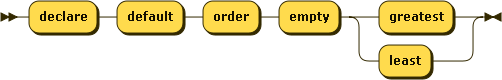

# Prologs

This section introduces prologs, which allows declaring functions and global variables that can then be used in the main query. A prolog also allows setting some default behaviour.

MainModule


Prolog


The prolog appears before the main query and is optional. It can contain setters and module imports, followed by function and variable declarations.

Module imports are explained in the next chapter.

### Setters. <a href="#setters.d12e5165" id="setters.d12e5165"></a>

Setters allow to specify a default behaviour for various aspects of the language.

#### Default collation <a href="#defaultcollation.d12e5173" id="defaultcollation.d12e5173"></a>

DefaultCollationDecl


This specifies the default collation used for grouping and ordering clauses in FLWOR expressions. It can be overriden with a collation directive in these clauses.

#### Default ordering mode <a href="#defaultorderingmode.d12e5193" id="defaultorderingmode.d12e5193"></a>

OrderingModeDecl


This specifies the default behaviour of from clauses, i.e., if they bind tuples in the order in which items occur in the binding sequence. It can be overriden with ordered and unordered expressions.

#### Default ordering behaviour for empty sequences <a href="#defaultorderingbehaviourforemptysequences.d12e5214" id="defaultorderingbehaviourforemptysequences.d12e5214"></a>

EmptyOrderDecl



This specifies whether empty sequences come first or last in an ordering clause. It can be overriden by the corresponding directives in such clauses.

#### Default decimal format <a href="#defaultdecimalformat.d12e5234" id="defaultdecimalformat.d12e5234"></a>

DecimalFormatDecl


DFPropertyName


This specifies a default decimal format for the builtin function format-number().

### Global variables <a href="#globalvariables.d12e5268" id="globalvariables.d12e5268"></a>

VarDecl


Variables can be declared global. Global variables are declared in the prolog.

#### Global variable

```

  declare variable $obj := { "foo" : "bar" };
  $obj
      
```

Result (run with Zorba):{ "foo" : "bar" }

#### Global variable

```

  declare variable $numbers := (1, 2, 3, 4, 5);
  [ $numbers ]
      
```

Result (run with Zorba):\[ 1, 2, 3, 4, 5 ]

You can specify a type for a variable. If the type does not match, an error is raised. Types will be explained later. In general, you do not need to worry too much about variable types except if you want to make sure that what you bind to a variable is really what you want. In most cases, the engine will take care of types for you.

#### Global variable with a type

```

  declare variable $obj as object := { "foo" : "bar" };
  $obj
      
```

Result (run with Zorba):{ "foo" : "bar" }

An external variable allows you to pass a value from the outside environment, which can be very useful. Each implementation can choose their own way of passing a value to an external variable. A default value for an external variable can also be supplied in case none is provided outside.

#### An external global variable

```

  declare variable $obj external;
  $obj
      
```

Result (run with Zorba):An error was raised: "obj": variable has no value

#### An external global variable with a default value

```

  declare variable $obj external := { "foo" : "bar" };
  $obj
      
```

Result (run with Zorba):{ "foo" : "bar" }

### Functions <a href="#functions.d12e5343" id="functions.d12e5343"></a>

VarDecl


You can define your own functions in the prolog. These user-defined functions must be prefixed with _local:_, both in the declaration and when called.

Remember than types are optional, and if you do not specify any, item\* is assumed, both for parameters and for the return type.

#### An external global variable with a default value

```

declare function local:say-hello($x) { "Hello, " || $x || "!" };
local:say-hello("Mister Spock")
      
```

Result (run with Zorba):Hello, Mister Spock!

#### An external global variable with a default value

```

declare function local:say-hello($x as string) { "Hello, " || $x || "!" };
local:say-hello("Mister Spock")
      
```

Result (run with Zorba):Hello, Mister Spock!

#### An external global variable with a default value

```

declare function local:say-hello($x as string) as string { "Hello, " || $x || "!" };
local:say-hello("Mister Spock")
      
```

Result (run with Zorba):Hello, Mister Spock!

If you do specify types, an error is raised in case of a mismatch

#### An external global variable with a default value

```

declare function local:say-hello($x) { "Hello, " || $x || "!" }; 
local:say-hello(1)
      
```

Result (run with Zorba):Hello, 1!
