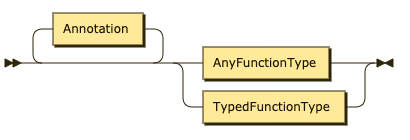
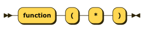

# The JSONiq type system

This section describes JSONiq types as well as the sequence type syntax.

JSONiq manipulates semi-structured data: in general, JSONiq allows you, but does not require you to specify types. So you have as much or as little type verification as you wish.

JSONiq is still strongly typed, so that you will be told if there is a type inconsistency or mismatch in your programs.

Whenever you do not specify the type of a variable or the type signature of a function, the most general type for any sequence of items, item\*, is assumed.

Section [Expressions dealing with types](the-jsoniq-type-system.md#section-type-expressions) introduces expressions which work with values of these types, as well as type operations (variable types, casts, ...).

### Sequence types 

JSONiq follows the [W3C standard](https://www.w3.org/TR/xquery-30/#id-sequencetype-syntax) regarding sequence occurrence indicators. The following explanations, provided as an informal summary for convenience, are non-normative.

A sequence is an ordered list of items.

All sequences match the sequence type _js:item\*_.

A sequence type is made of an item type followed by an occurrence indicator:

* \* stands for a sequence of any length (zero or more)
*
  * stands for a non-empty sequence (one or more)
* ? stands for an empty or a singleton sequence (zero or one)
* The absence of indicator stands for a singleton sequence (one).

Examples:

* string matches any singleton sequence containing a string.
* item+ matches any non-empty sequence.
* object? matches the empty sequence and any sequence containing one object.

JSONiq defines the syntax _()_ for the empty sequence, rather than _empty-sequence()_.

SequenceType

### Item types 

Item types are the first component of a sequence type, together with the cardinality indicator. Thus, an item type matches (or not) a single item. For example, "foo" matches the item type xs:string.

There are three categories of item types:

* Atomic types (W3C-conformant, additional js:null and js:atomic)
* Structured types (JSONiq-specific)
* Function types (W3C-conformant)

JSONiq uses a JSONiq-specific, implementation-defined default type namespace that acts as a proxy namespace to all types (xs: or js:). As a consequence, buitin atomic types do not need to be prefixed in the JSONiq syntax (_integer_ instead of _xs:integer_, _null_ instead of _js:null_).

All items match the item type _js:item_, which is a JSONiq-specific synonym for the W3C-confirmant _item()_.

ItemType

#### Atomic types 

JSONiq follows the [W3C standard](https://www.w3.org/TR/xquery-30/#id-types) for atomic types except for modifications in the list of available atomic types and a simplified syntax for xs:anyAtomicType. The following explanations, provided as an informal summary for convenience, are non-normative.

Atomic types are organized in a tree hierarchy.

JSONiq defines the following build-in types that have a direct relation with JSON:

*   _xs:string_: the value space is all strings made of Unicode characters.

    All string literals build an atomic which matches string.
*   _xs:integer_ (W3C-conformant): the value space is that of all mathematical integral numbers (N), with an infinite range. This is a subtype of _decimal_, so that all integers also match the item type _decimal_.

    All integer literals build an atomic which matches integer.
*   _xs:decimal_ (W3C-conformant): the value space is that of all mathematical decimal numbers (D), with an infinite range.

    All decimal literals build an atomic which matches decimal.
*   _xs:double_ (W3C-conformant): the value space is that of all IEEE double-precision 64-bit floating point numbers.

    All double literals build an atomic which matches double.
*   _xs:boolean_ (W3C-conformant): the value space contains the booleans true and false.

    All boolean literals build an atomic which matches boolean.
*   _js:null_ (JSONiq-specific): the value space is a singleton and only contains null.

    All null literals build an atomic which matches null.
*   _js:atomic_ (JSONiq-specific synonym of, and W3C-conformant with, _xs:anyAtomicType_): all atomic types.

    All literals build an atomic which matches atomic.

JSONiq also supports further atomic types, which are conformant with [XML Schema](http://www.w3.org/TR/xmlschema11-2/#built-in-datatypes).

These datatypes are already used as a set of atomic datatypes by the other two semi-structured data formats of the Web: XML and RDF, as well as by the corresponding query languages: XQuery and SPARQL, so it is natural for a complete JSON data model to reuse them.

* Further number types: xs:float, xs:long, xs:int, xs:short, xs:byte, xs:float, xs:positiveInteger, xs:negativeInteger, xs:nonPositiveInteger, xs:nonNegativeInteger, xs:unsignedLong, xs:unsignedInt, xs:unsignedShort, xs:unsignedByte.
* Date or time types: xs:date, xs:dateTime, xs:dateTimeStamp, xs:gDay, xs:gMonth, xs:gMonthDay, xs:gYear, xs:xs:gYearMonth, xs:time.
* Duration types: xs:duration, xs:dayTimeDuration, xs:yearMonthDuration.
* Binary types: xs:base64Binary, xs:hexBinary.
* An URI type: xs:anyURI.

The support of xs:ID, xs:IDREF, xs:IDREFS, xs:NOTATION, xs:Name, xs:NCName, xs:NMTOKEN, xs:NMTOKENS, xs:ENTITY, xs:ENTITIES is not required by JSONiq, although engines that also support XML can support them.

AtomicType

#### Structured types 

JSONiq introduces four more types for matching objects and arrays. Like atomic types, they do not need the _js:_ prefix in the syntax (_object_ instead of _js:object_, etc.).

All objects match the item type _js:object_.

All arrays match the item type _js:array_.

All objects and arrays match the item type _js:json-item_.

For engines that also support optionally XML, _js:structured-item_ matches both XML nodes and JSON objects and arrays.

StructuredType

#### Function types 

JSONiq follows the [W3C standard](https://www.w3.org/TR/xquery-30/#id-function-test) regarding function types. The following explanations are non-normative.

FunctionType

AnyFunctionType

TypedFunctionType

