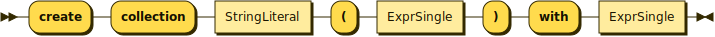
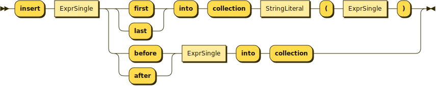
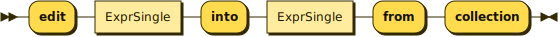

# Primary updating expressions

Update expressions are the visible part of JSONiq Updates in the language. Each primary updating expression contributes an update primitive to the Pending Update List being built.

## Nested updates (memory or persistent)

These expressions may appear in a copy-modify-return (transform) expression (for in-memory updates on cloned values), or outside (for persistent updates to an underlying storage).

### **Inserting values into an object or array**

\


<figure><figcaption></figcaption></figure>

A JSON insert expression is used to insert new pairs into an object. It produces a _jupd:insert-into-object_ update primitive. If the target is not an object, JNUP0008 is raised. If the content is not a sequence of objects, JNUP0019 is raised. These objects are merged prior to inserting the pairs into the target, and JNDY0003 is raised if the content to be inserted has colliding keys.

**Example**&#x20;

```
copy $obj := { "foo" : "bar" }
modify insert json { "bar" : 123, "foobar" : [ true, false ] } into $obj
return $obj
      
```

**Result:** { "foo" : "bar", "bar" : 123, "foobar" : \[ true, false ] }


A JSON insert expression is also used to insert a new member into an array. It produces a _jupd:insert-into-array_ update primitive. If the target is not an array, JNUP0008 is raised. If the position is not an integer, JNUP0007 is raised.

**Example**

```
copy $arr := { "foo" : [1,2,3,4] }
modify insert json 5 into $arr.foo at position 3
return $arr
      
```

**Result:** { "foo" : \[ 1, 2, 5, 3, 4 ] }

### **Deleting values in an object or array**

\


<figure><figcaption></figcaption></figure>

A JSON delete expression is used to remove a pair from an object. It produces a _jupd:delete-from-object_ update primitive. If the key is not a string, JNUP0007 is raised. If the key does not exist, JNUP0016 is raised.

**Example**&#x20;

```
copy $obj := { "foo" : "bar", "bar" : 123 }
modify delete json $obj.foo
return $obj
      
```

**Result:** { "bar" : 123 }


A JSON delete expression is also used to remove a member from an array. It produces a _jupd:insert-from-array_ update primitive. If the position is not an integer, JNUP0007 is raised. If the position is out of range, JNUP0016 is raised.

**Example**&#x20;

```
copy $arr := [1,2,3,4,5,6]
modify delete json $arr[[3]]
return $arr
      
```

**Result:** \[ 1, 2, 4, 5, 6 ]

\


### **Renaming a key**

\


<figure><figcaption></figcaption></figure>

A JSON rename expression is used to rename a key in an object. It produces a _jupd:rename-in-object_ update primitive. If the sequence on the left of the dot is not a single object, JNUP0008 is raised. If the new name is not a single string, JNUP0007 is raised. If the old key does not exist, JNUP0016 is raised.

**Example 196. JSON rename expression**

```
copy $obj := { "foo" : "bar", "bar" : 123 }
modify rename json $obj.foo as "foobar"
return $obj
      
```

**Result:** { "bar" : 123, "foobar" : "bar" }

### **Appending values to an array**

\


<figure><figcaption></figcaption></figure>

A JSON append expression is used to add a new member at the end of an array. It produces a _jupd:insert-into-array_ update primitive. JNUP0008 is raised if the target is not an array.

**Example 197. JSON append expression**

```
copy $obj := { "foo" : "bar", "bar" : [1,2,3] }
modify append json 4 into $obj.bar
return $obj
      
```

**Result:** { "foo" : "bar", "bar" : \[ 1, 2, 3, 4 ] }\


### **Replacing a value in an object or array.** 

<figure><figcaption></figcaption></figure>

A JSON replace expression is used to replace the value associated with a certain key in an object. It produces a _jupd:replace-in-object_ update primitive. JNUP0007 is raised if the selector is not a single string. If the selector key does not exist, JNUP0016 is raised.

**Example**&#x20;

```
copy $obj := { "foo" : "bar", "bar" : [1,2,3] }
modify replace value of json $obj.foo with { "nested" : true }
return $obj
      
```

**Result:** { "bar" : \[ 1, 2, 3 ], "foo" : { "nested" : true } }

A JSON replace expression is also used to replace a member in an array. It produces a _jupd:insert-in-array_ update primitive. JNUP0007 is raised if the selector is not a single position. If the selector position is out of range, JNUP0016 is raised.

**Example**

```
copy $obj := { "foo" : "bar", "bar" : [1,2,3] }
modify replace value of json $obj.bar[[2]] with "two"
return $obj
      
```

**Result:** { "foo" : "bar", "bar" : \[ 1, "two", 3 ] }

## Update expressions at the collection top-level (persistent only)

These expressions may not appear in a copy-modify-return (transform) expression because they can only be used for persistent updates to an underlying storage (document store, data lakehouse, etc).

### Creating a collection

<figure><figcaption></figcaption></figure>

This expression creates an update primitive that creates a collection.

**Example**&#x20;

```
create collection table("mytable") with ({"foo":1},{"foo":2}),
create collection delta-file("/path/to/file.delta") with ({"foo":1},{"foo":2})
```

### Deleting a collection

<figure><figcaption></figcaption></figure>

This expression creates an update primitive that deletes a collection.

**Example**&#x20;

```
delete collection table("mytable"),
delete collection delta-file("/path/to/file.delta")
```

### Inserting into a collection

<figure><figcaption></figcaption></figure>

This expression creates an update primitive that inserts values at the beginning or end of a collection, or before or after specific values in that collection.

**Example**

```
insert {"foo":3} first into collection table("mytable"),
insert {"foo":4} last into collection delta-file("/path/to/file.delta"),
insert {"foo":3} before table("mytable")[3] into collection,
insert {"foo":3} after delta-file("/path/to/file.delta")[3] into collection
```

### Editing a value in a collection

<figure><figcaption></figcaption></figure>

This expression creates an update primitive that modifies a value in a collection into the other supplied value.

**Example**

```
edit table("mytable")[1] into {"foo":3} in collection
```

### Deleting a value from a collection

<figure><figcaption></figcaption></figure>

This expression creates an update primitive that deletes a specified value from its collection.

**Example**

```
delete table("mytable")[1] from collection
```

